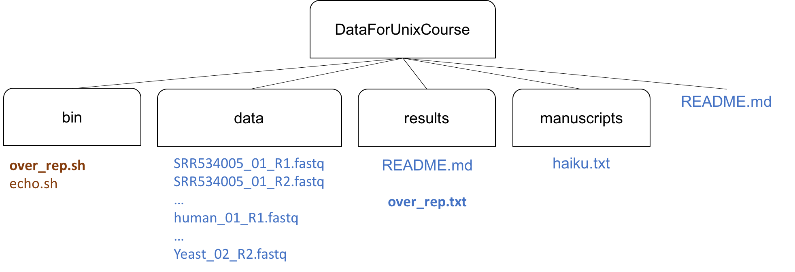

# Lesson 07: Bash Scripts

Let's write a script that will execute Scott's one liner to find the most overrepresented sequence. But, let's go over some of the file structure.

## bin

Bash scripts are special text files that end in `.sh`. The sh file lets the computer now that these files are executable. To execute a bash script you 

*Note:* For cloud computing, they must start with a header that lets the computer know what type of file it is. When working on stampede, all your files will begin with `#!/bin/bash`.

## bash overrepresented.sh

Let's write a script that contains the Unix one liner we played with earlier. The text editor notepad is the the fanciest, but it works. In two lines, let's create then open a text file 

~~~ {.bash}
$ touch overrepresented.sh
$ notepad overrepresented.sh 
~~~

Then insert the following line into the text file and save.

~~~
for file in *fastq; do echo $file; head -100000 ${file} | grep -A 1 '^@HWI' | grep -v '^@HWI' | sort | uniq -c | sort -n -r | head -n 2; done 
~~~

To execute the command, type `bash overrepresented.sh`

~~~ {.bash}
$ bash overrepresented.sh 
~~~

Yeah! Now we have a loop that we can call with `bash` rather than typing the loop all the time. 

## Data organization with bin and results

It's actually rally good practice to store you data, scripts, and results in separate places. Then, write your scripts so that you call the data from the data directory and sent the results to the results directory. 

### Challenge: Move your script into a new directory called bin

Do the following:
1. Make a new directory called bin inside DataForUnixCourse
2. Move `over overrepresented.sh` there.
3. Move into bin

One solution:
~~~ {.bash}
$ mkdir ../bin
$ mv overrepresented.sh ../bin
$ cd bin
$ ls
~~~

### Modify the script to get data from data and send output to a file in results
 
To modify our script, open the file with notepad. 

~~~ {.bash}
$ notepad overrepresented.sh 
~~~

Now, we need to make two modifications to the script:
1. Give the path to *fastq
2. Send the output to a new file in results

Here's one solution 

~~~
for file in ../data/*fastq; do echo $file; head -100000 ${file} | grep -A 1 '^@HWI' | grep -v '^@HWI' | sort | uniq -c | sort -n -r | head -n 2; done  > ../results/overrepresented.txt
~~~ 
 
~~~ {.bash}
$ bash overrepresented.sh 
~~~
 
Since nothing printed to the screen, we can use `ls` to see if the file is there or `head` to view the first ten lines
 
~~~ {.bash}
$ ls ../results
$ head ../results/overrepresented.txt
~~~ 

### Using the bash variable "$1"
That's nice, but what if we only want to do this for one sequence at a time, but we want this to work for future data sets. This is why variables are awesome. 

Let's replace `*.fastq` with the variable `"$1"` and prepend `"$1"` to overrepresented.txt. 

~~~
for file in ../data/"$1"; do echo $file; head -100000 ${file} | grep -A 1 '^@HWI' | grep -v '^@HWI' | sort | uniq -c | sort -n -r | head -n 2; done  > ../results/"$1"-overrepresented.txt
~~~

Now, when we execute the command, we will also specify the variable.

~~~ {.bash}
$ bash overrepresented.sh copy-human_01_R1.fastq
~~~
 
### Using the bash variable "$@"

Using `"$1"` or even `"$1"` and `"$2"` is nice when you want to work with a discrete number of files. However, if you want to use the `*` wildcard, you need to use the variable `"$@"`. Let's modify our overrepresnted

~~~
for file in ../data/"$@"; do echo $file; head -100000 ${file} | grep -A 1 '^@HWI' | grep -v '^@HWI' | sort | uniq -c | sort -n -r | head -n 2; done  > ../results/"$@"-overrepresented.txt
~~~

~~~ {.bash}
$ bash overrepresented.sh *.fastq
~~~ 

## Proceed Previous lesson
**Previous Lesson:** [06 For Loops](https://github.com/raynamharris/Shell_Intro_for_Transcriptomics/blob/master/06_ForLoops.md) 

